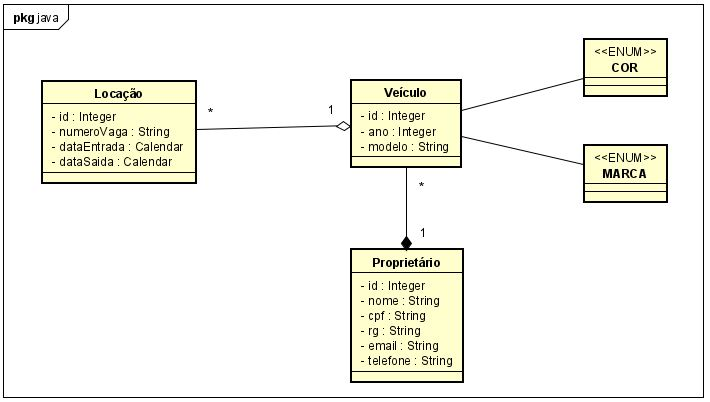

# ProjetoLPOOE1_NicolasScopel

## Descrição do Projeto
O presente projeto refere-se ao desenvolvimento de um sistema Java utilizando JPA para gerenciar o acesso a um banco de dados PostgreSQL. O projeto utiliza Maven como gerenciador de dependências e foi desenvolvido na disciplina de Linguagem de Programação Orientada a Objetos (LPOO) do curso de Bacharelado em Ciências da Computação do IFSUL, Câmpus Passo Fundo, durante o período letivo 2024-1.

## Modelagem Realizada
A modelagem do sistema incluiu as seguintes entidades e seus relacionamentos:

-- Algumas alterações foram realizadas de forma a deixar a modelagem mais coerente com os conteúdos trabalhados em sala de aula. 

